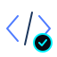
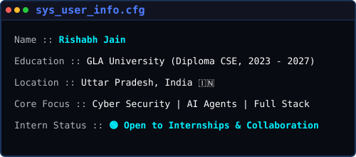
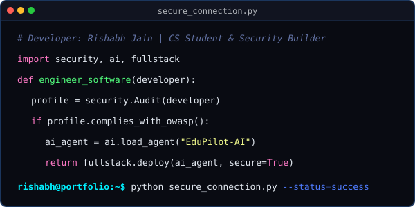

<!-- markdownlint-disable MD033 MD013 MD041 -->
<!-- TITLE: GitHub Profile OS - Rishabh Jain -->
<div align="center">
  
  <br /><br />
  
  <br />
  <a href="https://rishabh-jain-one.vercel.app" target="_blank"></a>
  <a href="https://www.linkedin.com/in/rishabh-jain-40079a396/" target="_blank"></a>
  <a href="mailto:rishabhjain071130@gmail.com"></a>
  <a href="https://github.com/rishabhjain071130-glitch"></a>
  <a href="https://rishabh-jain-one.vercel.app/resume/Resume_v2.pdf" target="_blank"></a>
  
  <br /><br />
  
</div>


##  01. User Profile
<div align="center"></div>
<br />
<details><summary><b>Click to expand raw user_profile.yaml</b></summary>

```yaml
Bio: |
  Building secure, intelligent, and scalable software through real-world engineering
  projects while continuously learning Cyber Security, AI, and Full Stack Development.
Location: Uttar Pradesh, India 🇮🇳
Academic:
  Institute: GLA University
  Program: Diploma in Computer Science & Engineering (2023 - 2027)
Career Status: 🟢 Open to Internships & Collaboration (Web Dev / Cyber Security)
OWASP Standard: 100% committed to Defensive Coding & Secure Implementations
```
</details>


##  02. System Specifications (Tech Stack)
```ini
[Programming Languages]
TypeScript = Intermediate
JavaScript = Intermediate
Python     = Intermediate
C          = Intermediate
SQL        = Intermediate

[Frontend Specifications]
React      = Intermediate
Next.js    = Intermediate
Tailwind   = Advanced
HTML5/CSS3 = Advanced

[Backend Engine]
Node.js    = Basics
Express.js = Basics
REST APIs  = Intermediate

[Databases]
MongoDB    = Basics
SQL        = Oracle Database SQL Certified Associate

[Cyber Security]
Web Security (OWASP) = Basics (Authorization, Data Sanitization)
Network Defense      = Basics (Gateway Protections, Firewall Management)
Networking           = Intermediate (TCP/IP, Routing & Subnetting)
Security Fundamentals = Intermediate

[Developer Tools]
Git & GitHub         = Intermediate
VS Code              = Advanced
```


##  03. Executables (Featured Projects)
<div align="center"></div>
<br />
### 📂 [Rishabh Portfolio OS](https://github.com/rishabhjain071130-glitch/rishabh-jain)
> **Frontend Engineering | Summer 2026**
* **Description**: A terminal-themed developer portfolio website featuring simulated CLI navigation, custom shell commands, and clean typography.
* **Architecture**: Responsive design, custom terminal components, lightweight CSS animations, and rate-limited dispatch modules.
* **Stack**: Next.js, React, Tailwind CSS, JavaScript, HTML, CSS, Git.
* **Links**: [📁 Source Repository](https://github.com/rishabhjain071130-glitch/rishabh-jain) | [⚡ Live Interactive App](https://rishabh-jain-one.vercel.app)

### 📂 [EduPilot AI](https://github.com/rishabhjain071130-glitch/EduPilot-AI)
> **Artificial Intelligence | Spring 2026**
* **Description**: A Python-based career mentorship helper that generates custom learning roadmaps.
* **Architecture**: Multi-agent system featuring interest evaluation forms, dashboards, and an interactive mentorship chatbot.
* **Stack**: Python, Streamlit, Git.
* **Links**: [📁 Source Repository](https://github.com/rishabhjain071130-glitch/EduPilot-AI) | [⚡ Live Interactive App](https://edupilot-ai-nitweutyqdvdwhc6uypzqb.streamlit.app/)

### 📂 [FinFlow (Digital Loan System)](https://github.com/rishabhjain071130-glitch/digitalloansystem)
> **Web Development | Winter 2025**
* **Description**: A simple budgeting web application built to track personal transactions and visualize spending categories.
* **Architecture**: Secure data sanitization, client-side transaction rendering, responsive dashboard grid.
* **Stack**: JavaScript, HTML, CSS, Git.
* **Links**: [📁 Source Repository](https://github.com/rishabhjain071130-glitch/digitalloansystem) | [⚡ Live Site Section](https://rishabh-jain-one.vercel.app/#projects)


## 04. Active Processes (Current Focus)
```text
[ACTIVE PROCESSES LOG]
--------------------------------------------------------------------------------
PID    PROCESS NAME             STATUS      PROGRESS / ACTION TARGET
--------------------------------------------------------------------------------
1001   building:portfolio_os    RUNNING     Refining terminal command extensions
1002   learning:cyber_security  RUNNING     Palo Alto Network Gateway associate certs
1003   learning:agentic_ai      RUNNING     Building multi-agent task flows (Python)
1004   reading:owasp_guide      WAITING     Reviewing secure session/token management
1005   preparing:internships    ACTIVE      Preparing core DSA & secure coding patterns
--------------------------------------------------------------------------------
```


## 05. Performance Metrics (Analytics)

<div align="center">
  <table border="0">
    <tr>
      <td width="50%" align="center" valign="top">
        
      </td>
      <td width="50%" align="center" valign="top">
        
      </td>
    </tr>
    <tr>
      <td colspan="2" align="center" valign="top">
        <br />
        
      </td>
    </tr>
  </table>
  <br />
  <h4>Contribution Grid Activity</h4>
  <picture>
    <source media="(prefers-color-scheme: dark)" srcset="https://raw.githubusercontent.com/rishabhjain071130-glitch/rishabhjain071130-glitch/output/github-contribution-grid-snake-dark.svg" />
    <source media="(prefers-color-scheme: light)" srcset="https://raw.githubusercontent.com/rishabhjain071130-glitch/rishabhjain071130-glitch/output/github-contribution-grid-snake.svg" />
    
  </picture>
</div>


<div align="center"><sub>Portfolio OS (V1.0.0) | Securely Engineered by <a href="https://github.com/rishabhjain071130-glitch">rishabhjain071130-glitch</a></sub></div>
